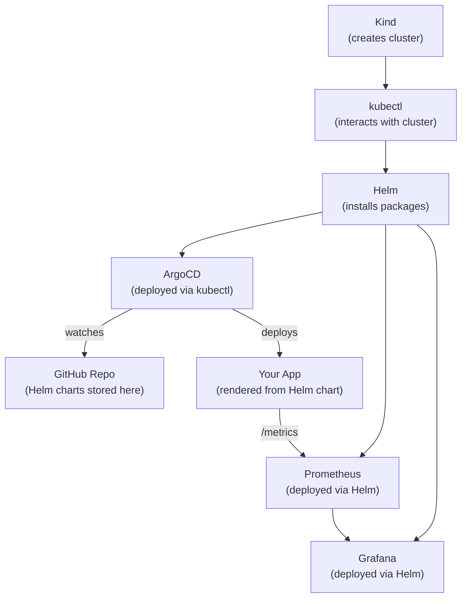

# Production Kubernetes Deployment: A Complete Guide

A comprehensive, step-by-step guide to deploying, monitoring, and maintaining a production-grade application on a local Kubernetes cluster. This guide covers the full lifecycle — from cluster creation to GitOps-driven deployments with observability.

By the end of this guide, you will have:
- A **multi-node Kubernetes cluster** running locally via Kind
- A **production-relevant REST API** containerized and pushed to Docker Hub
- A **Helm chart** managing all Kubernetes manifests
- **ArgoCD** watching a GitHub repository and auto-deploying changes
- **Prometheus + Grafana** providing full observability

---

## Table of Contents

1. [Architecture Overview](#1-architecture-overview)
2. [Understanding the Tools](#2-understanding-the-tools)
3. [Phase 1: Setting Up the Kubernetes Cluster](#3-phase-1-setting-up-the-kubernetes-cluster)
4. [Phase 2: Building a Production-Relevant Application](#4-phase-2-building-a-production-relevant-application)
5. [Phase 3: Dockerizing the Application](#5-phase-3-dockerizing-the-application)
6. [Phase 4: Creating Helm Charts](#6-phase-4-creating-helm-charts)
7. [Phase 5: Setting Up GitOps with ArgoCD](#7-phase-5-setting-up-gitops-with-argocd)
8. [Phase 6: Configuring Observability](#8-phase-6-configuring-observability)
9. [Deep Dive: How Helm Works](#9-deep-dive-how-helm-works)
10. [Deep Dive: How ArgoCD Works](#10-deep-dive-how-argocd-works)
11. [Deploying a Different Application](#11-deploying-a-different-application)
12. [Troubleshooting Guide](#12-troubleshooting-guide)
13. [Glossary](#13-glossary)

---

## 1. Architecture Overview

### The Big Picture

```
┌─────────────────────────────────────────────────────────────────────────┐
│                        DEVELOPER WORKSTATION                           │
│                                                                        │
│   ┌──────────┐     ┌──────────┐     ┌─────────────────────────────┐   │
│   │ App Code │────>│ Docker   │────>│ Docker Hub                  │   │
│   │ (Python) │     │ Build    │     │ (chandubodduluri/           │   │
│   └──────────┘     └──────────┘     │  bookshelf-api:1.0.0)      │   │
│                                      └──────────┬──────────────────┘   │
│   ┌──────────┐     ┌──────────┐                 │                     │
│   │ Helm     │────>│ GitHub   │                 │                     │
│   │ Charts   │     │ Repo     │                 │                     │
│   └──────────┘     └────┬─────┘                 │                     │
│                          │                       │                     │
│   ┌──────────────────────┼───────────────────────┼─────────────────┐  │
│   │             KIND CLUSTER (Docker containers)  │                 │  │
│   │                      │                       │                 │  │
│   │   ┌──────────────────▼───────────────────┐   │                 │  │
│   │   │ ArgoCD                               │   │                 │  │
│   │   │  • Watches GitHub for changes        │   │                 │  │
│   │   │  • Renders Helm charts               │   │                 │  │
│   │   │  • Applies K8s manifests             │   │                 │  │
│   │   └──────────────────┬───────────────────┘   │                 │  │
│   │                      │ deploys               │                 │  │
│   │   ┌──────────────────▼───────────────────┐   │                 │  │
│   │   │ Application (bookshelf namespace)    │◄──┘ pulls image     │  │
│   │   │  • Deployment (2 pods)               │                     │  │
│   │   │  • Service (ClusterIP)               │                     │  │
│   │   │  • Ingress (NGINX)                   │                     │  │
│   │   │  • HPA (auto-scaling)                │                     │  │
│   │   │  • ServiceMonitor                    │                     │  │
│   │   └──────────────────┬───────────────────┘                     │  │
│   │                      │ /metrics                                │  │
│   │   ┌──────────────────▼───────────────────┐                     │  │
│   │   │ Monitoring (monitoring namespace)    │                     │  │
│   │   │  • Prometheus (scrapes metrics)      │                     │  │
│   │   │  • Grafana (visualizes dashboards)   │                     │  │
│   │   │  • Alertmanager                      │                     │  │
│   │   └──────────────────────────────────────┘                     │  │
│   │                                                                │  │
│   │   Nodes:                                                       │  │
│   │   ┌────────────┐ ┌────────┐ ┌────────┐ ┌────────┐            │  │
│   │   │Control     │ │Worker  │ │Worker  │ │Worker  │            │  │
│   │   │Plane       │ │1       │ │2       │ │3       │            │  │
│   │   └────────────┘ └────────┘ └────────┘ └────────┘            │  │
│   └────────────────────────────────────────────────────────────────┘  │
└─────────────────────────────────────────────────────────────────────────┘
```

### How the Components Interact

The deployment pipeline flows in **two distinct paths**:

**Path 1 — Container Image Path:**
```
Developer writes code → Builds Docker image → Pushes to Docker Hub
```

**Path 2 — Configuration Path (GitOps):**
```
Developer writes Helm chart → Pushes to GitHub → ArgoCD detects change → 
ArgoCD renders Helm templates → Applies Kubernetes manifests → 
Kubernetes pulls image from Docker Hub → Pods start running
```

**Path 3 — Observability Path:**
```
App pod exposes /metrics → Prometheus scrapes it via ServiceMonitor → 
Grafana queries Prometheus → Dashboards display metrics
```

The key insight is that **code changes** (Path 1) and **configuration changes** (Path 2) are decoupled. You can update the Docker image tag independently from how the app is deployed.

---

## 2. Understanding the Tools

### What Each Tool Does and Why It's Needed

| Tool | Role | Analogy |
|------|------|---------|
| **Kind** | Creates a local multi-node Kubernetes cluster using Docker containers | A "lab environment" that mimics a cloud cluster |
| **Docker** | Packages the application into a portable container image | A "shipping container" for your app |
| **Docker Hub** | Stores container images in a public registry | A "warehouse" where Kubernetes pulls images from |
| **kubectl** | CLI to interact with the Kubernetes API server | The "remote control" for your cluster |
| **Helm** | Templates and packages Kubernetes YAML manifests | A "package manager" for Kubernetes (like apt/brew) |
| **ArgoCD** | Watches a Git repo and syncs its state to the cluster | An "autopilot" that keeps the cluster in sync with Git |
| **Prometheus** | Scrapes and stores time-series metrics from applications | A "data collector" that polls apps for stats |
| **Grafana** | Visualizes metrics with dashboards and graphs | A "TV screen" that displays the data Prometheus collects |

### How They Relate to Each Other



---

## 3. Phase 1: Setting Up the Kubernetes Cluster

### 3.1 Prerequisites

Install these tools first (on Windows with Chocolatey):

```powershell
# Install Chocolatey (run as Administrator)
Set-ExecutionPolicy Bypass -Scope Process -Force
[System.Net.ServicePointManager]::SecurityProtocol = [System.Net.ServicePointManager]::SecurityProtocol -bor 3072
iex ((New-Object System.Net.WebClient).DownloadString('https://community.chocolatey.org/install.ps1'))

# Install the tools
choco install kubernetes-cli -y      # kubectl
choco install kubernetes-helm -y     # helm
choco install kind -y                # kind
choco install docker-desktop -y      # Docker Desktop (if not installed)
```

### 3.2 Create a Kind Cluster

Kind (Kubernetes in Docker) runs Kubernetes nodes as Docker containers. Each "node" is a Docker container that runs kubelet and a container runtime inside it.

**Create the cluster configuration:**

```yaml
# kind-config.yaml
kind: Cluster
apiVersion: kind.x-k8s.io/v1alpha4
name: learning-cluster
nodes:
  # Control plane node — runs the API server, scheduler, etcd
  - role: control-plane
    kubeadmConfigPatches:
      - |
        kind: InitConfiguration
        nodeRegistration:
          kubeletExtraArgs:
            node-labels: "ingress-ready=true"
    # Map container ports to host ports for Ingress access
    extraPortMappings:
      - containerPort: 80
        hostPort: 80
        protocol: TCP
      - containerPort: 443
        hostPort: 443
        protocol: TCP
  # Worker nodes — where your application pods run
  - role: worker
  - role: worker
  - role: worker
```

**Understanding the node roles:**

| Node | Purpose | What Runs Here |
|------|---------|----------------|
| **Control Plane** | Manages the cluster | API Server, Scheduler, Controller Manager, etcd |
| **Worker 1–3** | Runs workloads | Your application pods, monitoring, ArgoCD |

```powershell
# Create the cluster
kind create cluster --config kind-config.yaml

# Verify — you should see 4 nodes
kubectl get nodes
```

**Expected output:**
```
NAME                             STATUS   ROLES           AGE   VERSION
learning-cluster-control-plane   Ready    control-plane   1m    v1.35.0
learning-cluster-worker          Ready    <none>          1m    v1.35.0
learning-cluster-worker2         Ready    <none>          1m    v1.35.0
learning-cluster-worker3         Ready    <none>          1m    v1.35.0
```

### 3.3 What `kind create cluster` Actually Does

Behind the scenes, Kind:
1. Pulls a special Docker image (`kindest/node`) that contains Kubernetes
2. Starts 4 Docker containers (1 control-plane + 3 workers)
3. Runs `kubeadm init` inside the control-plane to bootstrap Kubernetes
4. Runs `kubeadm join` inside each worker to join them to the cluster
5. Writes a kubeconfig file to `~/.kube/config` so `kubectl` knows how to connect
6. Sets the current context to `kind-learning-cluster`

You can verify this by running:
```powershell
docker ps --filter "label=io.x-k8s.kind.role"
# Shows 4 containers — one per node
```

### 3.4 Install Cluster Add-ons

**NGINX Ingress Controller** — routes external HTTP traffic to your services:
```powershell
kubectl apply -f https://raw.githubusercontent.com/kubernetes/ingress-nginx/main/deploy/static/provider/kind/deploy.yaml
kubectl wait --namespace ingress-nginx --for=condition=ready pod --selector=app.kubernetes.io/component=controller --timeout=90s
```

**Metrics Server** — enables `kubectl top` and Horizontal Pod Autoscaler:
```powershell
kubectl apply -f https://github.com/kubernetes-sigs/metrics-server/releases/latest/download/components.yaml

# Kind uses self-signed certs, so patch metrics-server to accept them
kubectl patch deployment metrics-server -n kube-system --type='json' -p='[{"op": "add", "path": "/spec/template/spec/containers/0/args/-", "value": "--kubelet-insecure-tls"}]'
```

---

## 4. Phase 2: Building a Production-Relevant Application

### 4.1 Why This Application Design Matters

A production application isn't just "code that works." It needs specific features for Kubernetes to manage it properly:

| Feature | Purpose in Kubernetes | Without It |
|---------|----------------------|------------|
| **Health checks** (`/healthz`, `/readyz`) | Kubernetes uses these to decide if a pod is alive and ready | K8s can't self-heal; broken pods keep receiving traffic |
| **Metrics endpoint** (`/metrics`) | Prometheus scrapes this to collect performance data | No visibility into app performance |
| **Structured logging** | Log aggregation tools (Loki, ELK) can parse JSON logs | Unstructured logs are hard to search and filter |
| **Graceful shutdown** | Allows in-flight requests to complete before pod termination | Users see errors during deployments |
| **Config via env vars** | Values change between environments (dev/staging/prod) | Hardcoded configs require code changes per environment |

### 4.2 Project Structure

```
bookshelf-api/
├── app/
│   ├── __init__.py      # Package marker
│   ├── main.py          # Application entry point, health checks, middleware
│   ├── models.py        # Database model + API schemas
│   ├── database.py      # Database connection setup
│   ├── routes.py        # CRUD API endpoints
│   └── metrics.py       # Prometheus metrics definitions
├── helm/                # Kubernetes deployment configuration (Phase 4)
│   └── bookshelf-api/
├── requirements.txt     # Python dependencies
├── Dockerfile           # Container build instructions
├── .dockerignore        # Files to exclude from Docker build
├── argocd-app.yaml      # ArgoCD configuration (Phase 5)
├── grafana-dashboard.yaml   # Grafana dashboard (Phase 6)
└── README.md
```

### 4.3 Key Application Files Explained

#### `app/main.py` — The Heart of the Application

This file does several critical things:

```python
# 1. STRUCTURED LOGGING — outputs JSON instead of plain text
#    This is critical for log aggregation tools like Loki or ELK
formatter = logging.Formatter(
    fmt='{"time":"%(asctime)s","level":"%(levelname)s","message":"%(message)s"}',
)

# 2. LIFESPAN MANAGEMENT — graceful startup and shutdown
@asynccontextmanager
async def lifespan(app: FastAPI):
    logger.info("Starting Bookshelf API — creating database tables")
    Base.metadata.create_all(bind=engine)   # Create tables on startup
    yield                                     # App runs here
    logger.info("Shutting down Bookshelf API")  # Cleanup on shutdown

# 3. HEALTH CHECK ENDPOINTS — Kubernetes probes these
@app.get("/healthz")            # Liveness: "Is the process alive?"
def liveness():
    return {"status": "alive"}

@app.get("/readyz")             # Readiness: "Can it serve traffic?"
def readiness():
    db.execute(text("SELECT 1"))  # Checks DB connection
    return {"status": "ready"}

# 4. METRICS MIDDLEWARE — counts every request for Prometheus
@app.middleware("http")
async def metrics_middleware(request, call_next):
    start = time.perf_counter()
    response = await call_next(request)
    duration = time.perf_counter() - start
    REQUEST_COUNT.labels(method=request.method, endpoint=path, status=response.status_code).inc()
    REQUEST_DURATION.labels(method=request.method, endpoint=path).observe(duration)
    return response
```

**How Kubernetes uses these endpoints:**

```
                    ┌─── Liveness Probe (/healthz)
                    │    Every 15s: "Are you alive?"
                    │    If fails 3 times → restart the pod
                    │
Pod starts ────────>├─── Readiness Probe (/readyz)
                    │    Every 10s: "Can you serve traffic?"
                    │    If fails → remove from Service (no traffic)
                    │
                    └─── Metrics (/metrics)
                         Every 15s: Prometheus scrapes this
```

#### `app/metrics.py` — Prometheus Instrumentation

```python
# COUNTER — goes up monotonically (never decreases)
# Used for: total requests, errors, items created
REQUEST_COUNT = Counter(
    "http_requests_total",            # Metric name
    "Total number of HTTP requests",  # Description
    ["method", "endpoint", "status"], # Labels for filtering
)

# HISTOGRAM — tracks distribution of values
# Used for: request duration, response sizes
REQUEST_DURATION = Histogram(
    "http_request_duration_seconds",
    "HTTP request duration in seconds",
    ["method", "endpoint"],
    buckets=[0.005, 0.01, 0.025, 0.05, 0.1, 0.25, 0.5, 1.0, 2.5, 5.0],
)
```

When Prometheus scrapes `/metrics`, it gets output like:
```
# HELP http_requests_total Total number of HTTP requests
# TYPE http_requests_total counter
http_requests_total{method="GET",endpoint="/books",status="200"} 42.0
http_requests_total{method="POST",endpoint="/books",status="201"} 5.0

# HELP http_request_duration_seconds HTTP request duration in seconds
# TYPE http_request_duration_seconds histogram
http_request_duration_seconds_bucket{method="GET",endpoint="/books",le="0.01"} 38.0
http_request_duration_seconds_bucket{method="GET",endpoint="/books",le="0.025"} 41.0
```

#### `app/routes.py` — CRUD Endpoints

Standard REST API with pagination, error handling, and logging:

| Method | Endpoint | Description | Status Code |
|--------|----------|-------------|-------------|
| `GET` | `/books` | List books (paginated) | 200 |
| `GET` | `/books/{id}` | Get single book | 200 / 404 |
| `POST` | `/books` | Create a book | 201 |
| `PUT` | `/books/{id}` | Update a book | 200 / 404 |
| `DELETE` | `/books/{id}` | Delete a book | 204 / 404 |

---

## 5. Phase 3: Dockerizing the Application

### 5.1 Understanding the Dockerfile

```dockerfile
# ──────────────────────────────────────────────────────
# STAGE 1: Builder — install dependencies only
# ──────────────────────────────────────────────────────
FROM python:3.12-slim AS builder
WORKDIR /build
COPY requirements.txt .
RUN pip install --no-cache-dir --prefix=/install -r requirements.txt
# Why a separate stage? So the final image doesn't contain pip,
# build tools, or cached downloads — making it smaller and safer.

# ──────────────────────────────────────────────────────
# STAGE 2: Production — minimal runtime image
# ──────────────────────────────────────────────────────
FROM python:3.12-slim

# SECURITY: Create a non-root user
# Why? If the container is compromised, the attacker has limited permissions
RUN groupadd -r appuser && useradd -r -g appuser -d /app -s /sbin/nologin appuser

WORKDIR /app

# Copy only the installed packages from the builder stage
COPY --from=builder /install /usr/local

# Copy the application code
COPY app/ ./app/

RUN chown -R appuser:appuser /app
USER appuser    # Switch to non-root user

# Environment variables
ENV PYTHONUNBUFFERED=1 \          # Don't buffer stdout (important for logs)
    PYTHONDONTWRITEBYTECODE=1 \   # Don't create .pyc files
    LOG_LEVEL=INFO

EXPOSE 8000

# HEALTHCHECK — Docker's built-in health check
# Kubernetes has its own probes, but this is useful for local testing
HEALTHCHECK --interval=30s --timeout=5s --start-period=10s --retries=3 \
    CMD python -c "import urllib.request; urllib.request.urlopen('http://localhost:8000/healthz')" || exit 1

# Run the application
CMD ["uvicorn", "app.main:app", "--host", "0.0.0.0", "--port", "8000", "--workers", "1"]
```

### 5.2 Multi-Stage Build — Why It Matters

```
┌────────────────────────────┐     ┌────────────────────────────┐
│ STAGE 1: Builder           │     │ STAGE 2: Production        │
│                            │     │                            │
│ python:3.12-slim           │     │ python:3.12-slim           │
│ + pip                      │     │ + installed packages only  │
│ + build tools              │     │ + app code only            │
│ + requirements.txt         │     │ + non-root user            │
│ + all cached downloads     │     │                            │
│                            │     │ Size: ~150MB               │
│ Size: ~400MB               │     │ Attack surface: MINIMAL    │
│ (thrown away)               │     │ (this is what runs)        │
└────────────────────────────┘     └────────────────────────────┘
```

### 5.3 Build, Test, and Push

```powershell
# Build the image with a semantic version tag
docker build -t chandubodduluri/bookshelf-api:1.0.0 .

# Test locally — verify health check works
docker run -d -p 8000:8000 --name bookshelf-test chandubodduluri/bookshelf-api:1.0.0
curl.exe http://localhost:8000/healthz     # → {"status":"alive"}
curl.exe http://localhost:8000/docs        # → Swagger UI
curl.exe http://localhost:8000/metrics     # → Prometheus metrics

# Clean up the test container
docker stop bookshelf-test && docker rm bookshelf-test

# Push to Docker Hub (login first if needed: docker login)
docker push chandubodduluri/bookshelf-api:1.0.0
```

> **Why semantic versioning instead of `latest`?**
> Using `latest` makes deployments non-reproducible — you can't tell which version is running. With `1.0.0`, you can always rollback to an exact known version.

---

## 6. Phase 4: Creating Helm Charts

### 6.1 What Problem Does Helm Solve?

Without Helm, deploying an application to Kubernetes requires writing multiple YAML files:

```
deployment.yaml     — How to run the app (image, replicas, resources)
service.yaml        — How to expose the app internally
ingress.yaml        — How to expose the app externally
hpa.yaml            — Auto-scaling rules
serviceaccount.yaml — Security identity
servicemonitor.yaml — Prometheus scraping config
```

Each file has **hardcoded values** — if you want to change the replica count, image tag, or resource limits, you'd edit files manually. This is error-prone and doesn't scale.

**Helm solves this by:**
1. **Templating** — YAML files use `{{ .Values.xxx }}` placeholders instead of hardcoded values
2. **Central configuration** — all configurable values live in one `values.yaml` file
3. **Packaging** — the entire set of templates is bundled as a "chart" that can be versioned
4. **Release management** — Helm tracks what's deployed and supports rollbacks

### 6.2 Helm Chart Structure

```
helm/bookshelf-api/
├── Chart.yaml              # Chart metadata (name, version)
├── values.yaml             # Default configuration values
└── templates/              # Kubernetes manifest templates
    ├── _helpers.tpl         # Reusable template functions
    ├── deployment.yaml      # Pod specification
    ├── service.yaml         # Network exposure
    ├── ingress.yaml         # External routing
    ├── hpa.yaml             # Auto-scaling
    ├── serviceaccount.yaml  # Security identity
    ├── servicemonitor.yaml  # Prometheus integration
    └── NOTES.txt            # Post-install help message
```

### 6.3 The values.yaml File — Your Control Panel

This is the **single source of truth** for all configuration. Instead of editing multiple YAML files, you change values here:

```yaml
# How many copies of your app to run
replicaCount: 2

# Which container image to use
image:
  repository: chandubodduluri/bookshelf-api
  tag: "1.0.0"
  pullPolicy: IfNotPresent

# Network exposure
service:
  type: ClusterIP       # Internal only (Ingress handles external)
  port: 80              # Service port
  targetPort: 8000      # Container port

# External access via NGINX Ingress
ingress:
  enabled: true
  className: nginx
  hosts:
    - host: bookshelf.local
      paths:
        - path: /
          pathType: Prefix

# Resource guardrails — prevents one app from consuming all cluster resources
resources:
  requests:              # Minimum guaranteed resources
    cpu: 50m             # 50 millicores (5% of a CPU core)
    memory: 64Mi         # 64 megabytes
  limits:                # Maximum allowed resources
    cpu: 200m            # 200 millicores (20% of a CPU core)
    memory: 128Mi        # 128 megabytes

# Auto-scaling — add more pods when CPU is high
autoscaling:
  enabled: true
  minReplicas: 2
  maxReplicas: 6
  targetCPUUtilizationPercentage: 70

# Prometheus scraping configuration
serviceMonitor:
  enabled: true
  interval: 15s
  path: /metrics
  labels:
    release: prometheus  # Must match the Prometheus operator's release name
```

### 6.4 How Templates Work — From values.yaml to Kubernetes YAML

When Helm renders a template, it replaces `{{ }}` placeholders with values from `values.yaml`:

**Template** (`deployment.yaml`):
```yaml
spec:
  replicas: {{ .Values.replicaCount }}
  template:
    spec:
      containers:
        - name: {{ .Chart.Name }}
          image: "{{ .Values.image.repository }}:{{ .Values.image.tag }}"
          resources:
            {{- toYaml .Values.resources | nindent 12 }}
```

**Rendered output** (what Kubernetes actually receives):
```yaml
spec:
  replicas: 2
  template:
    spec:
      containers:
        - name: bookshelf-api
          image: "chandubodduluri/bookshelf-api:1.0.0"
          resources:
            requests:
              cpu: 50m
              memory: 64Mi
            limits:
              cpu: 200m
              memory: 128Mi
```

### 6.5 Template Helper Functions (`_helpers.tpl`)

The `_helpers.tpl` file defines reusable label sets so you don't repeat them in every template:

```yaml
# These labels are applied to EVERY Kubernetes resource
{{- define "bookshelf-api.labels" -}}
helm.sh/chart: {{ .Chart.Name }}-{{ .Chart.Version }}
app.kubernetes.io/name: {{ .Chart.Name }}
app.kubernetes.io/instance: {{ .Release.Name }}
app.kubernetes.io/version: {{ .Chart.AppVersion }}
app.kubernetes.io/managed-by: {{ .Release.Service }}
app: {{ .Chart.Name }}
{{- end }}

# These labels are used by Services to find Pods
{{- define "bookshelf-api.selectorLabels" -}}
app.kubernetes.io/name: {{ .Chart.Name }}
app.kubernetes.io/instance: {{ .Release.Name }}
app: {{ .Chart.Name }}
{{- end }}
```

**Why consistent labels matter:** Services use `selector` labels to find pods. If the labels don't match between the Deployment and Service, traffic won't reach your app.

### 6.6 The ServiceMonitor — Bridge Between App and Prometheus

```yaml
# servicemonitor.yaml
apiVersion: monitoring.coreos.com/v1
kind: ServiceMonitor
metadata:
  name: {{ include "bookshelf-api.fullname" . }}
  labels:
    release: prometheus    # ← THIS LABEL IS CRITICAL
spec:
  selector:
    matchLabels:
      {{- include "bookshelf-api.selectorLabels" . | nindent 6 }}
  endpoints:
    - port: http
      path: /metrics       # ← WHERE to scrape
      interval: 15s        # ← HOW OFTEN to scrape
```

**How Prometheus discovers what to scrape:**
```
Prometheus Operator
      │
      ├── Looks for ServiceMonitor resources with label "release: prometheus"
      │
      └── Found: bookshelf-api ServiceMonitor
            │
            ├── selector: app.kubernetes.io/name = bookshelf-api
            │
            └── Finds matching Service → finds pod endpoints → scrapes /metrics
```

### 6.7 Testing the Helm Chart

```powershell
# Dry-run: see what Helm would generate without installing
helm template bookshelf-api ./helm/bookshelf-api

# Validate: check for syntax errors
helm lint ./helm/bookshelf-api

# Install directly (useful for testing without ArgoCD)
helm install bookshelf-api ./helm/bookshelf-api --namespace bookshelf --create-namespace

# Verify
kubectl get all -n bookshelf

# Uninstall (cleanup)
helm uninstall bookshelf-api -n bookshelf
```

---

## 7. Phase 5: Setting Up GitOps with ArgoCD

### 7.1 What is GitOps?

GitOps is a deployment methodology where:
- **Git is the single source of truth** for the desired state of your cluster
- A tool (ArgoCD) **continuously watches** the Git repo
- If the repo changes, the tool **automatically applies** the changes to the cluster
- If someone manually changes something in the cluster, the tool **reverts it** (self-heal)

```
Traditional Deployment:
  Developer → kubectl apply → Cluster
  (manual, error-prone, no audit trail)

GitOps Deployment:
  Developer → git push → GitHub → ArgoCD → Cluster
  (automated, auditable, self-healing)
```

### 7.2 Installing ArgoCD

```powershell
# Create namespace
kubectl create namespace argocd

# Install ArgoCD
kubectl apply -n argocd -f https://raw.githubusercontent.com/argoproj/argo-cd/stable/manifests/install.yaml

# Wait for all pods to be ready
kubectl wait --for=condition=Ready pods --all -n argocd --timeout=300s
```

**What ArgoCD deploys in the cluster:**

| Component | Purpose |
|-----------|---------|
| `argocd-server` | Web UI and API server |
| `argocd-repo-server` | Clones Git repos and renders manifests (Helm/Kustomize) |
| `argocd-application-controller` | Compares desired state (Git) vs actual state (cluster) |
| `argocd-redis` | Cache layer for performance |
| `argocd-dex-server` | SSO/authentication (optional) |
| `argocd-applicationset-controller` | Manages ApplicationSets (multi-app patterns) |
| `argocd-notifications-controller` | Sends notifications (Slack, email, etc.) |

### 7.3 The ArgoCD Application Manifest

This YAML tells ArgoCD **what to deploy** and **where from**:

```yaml
# argocd-app.yaml
apiVersion: argoproj.io/v1alpha1
kind: Application
metadata:
  name: bookshelf-api
  namespace: argocd           # ArgoCD Applications always live here
spec:
  project: default            # ArgoCD project (access control)

  source:
    repoURL: https://github.com/ChandraVardhan97/k8s-prod-app.git
    targetRevision: main      # Which branch to watch
    path: helm/bookshelf-api  # Where the Helm chart lives in the repo
    helm:
      valueFiles:
        - values.yaml         # Which values file to use

  destination:
    server: https://kubernetes.default.svc  # Deploy to this cluster
    namespace: bookshelf                     # Deploy to this namespace

  syncPolicy:
    automated:
      prune: true       # Delete resources that no longer exist in Git
      selfHeal: true    # Revert manual changes made in the cluster
    syncOptions:
      - CreateNamespace=true  # Create the namespace if it doesn't exist
```

**Key concepts explained:**

| Field | Meaning |
|-------|---------|
| `source.repoURL` | The Git repo to watch |
| `source.path` | The directory within the repo containing the Helm chart |
| `source.targetRevision` | Which branch/tag to track (usually `main`) |
| `destination.namespace` | Where to deploy the rendered manifests |
| `syncPolicy.automated` | ArgoCD syncs automatically (no manual trigger needed) |
| `prune: true` | If you delete a template from the chart, ArgoCD deletes the resource from the cluster |
| `selfHeal: true` | If someone runs `kubectl edit` directly, ArgoCD reverts it back to Git's state |

### 7.4 Applying the ArgoCD Application

```powershell
kubectl apply -f argocd-app.yaml
```

This creates an `Application` resource in the `argocd` namespace. ArgoCD then:

1. **Clones** the Git repo
2. **Finds** the Helm chart at `helm/bookshelf-api/`
3. **Renders** the templates using `values.yaml`
4. **Compares** the rendered manifests against what's currently in the cluster
5. **Applies** any differences (creates/updates/deletes resources)
6. **Reports** health status

### 7.5 Accessing the ArgoCD UI

```powershell
# Get the admin password
kubectl -n argocd get secret argocd-initial-admin-secret -o jsonpath="{.data.password}" | ForEach-Object { [System.Text.Encoding]::UTF8.GetString([System.Convert]::FromBase64String($_)) }

# Port-forward
kubectl port-forward svc/argocd-server -n argocd 8080:443
```

Open https://localhost:8080 → Login with `admin` and the password from above.

### 7.6 The GitOps Workflow in Practice

```
1. Developer changes values.yaml:
   replicaCount: 2  →  replicaCount: 3

2. git add . && git commit -m "scale up" && git push

3. ArgoCD detects change (polls every 3 minutes by default)

4. ArgoCD re-renders the Helm chart with new values

5. ArgoCD compares:
   Current: Deployment has 2 replicas
   Desired: Deployment should have 3 replicas

6. ArgoCD applies: kubectl scale deployment bookshelf-api --replicas=3

7. ArgoCD reports: Synced ✓, Healthy ✓
```

### 7.7 Push the Helm Chart to GitHub

```powershell
# Initialize git repo
cd C:\Users\chand\.gemini\antigravity\scratch\bookshelf-api
git init
git remote add origin https://github.com/ChandraVardhan97/k8s-prod-app.git

# Commit and push
git add -A
git commit -m "feat: initial bookshelf-api with Helm chart and ArgoCD config"
git branch -M main
git push -u origin main
```

---

## 8. Phase 6: Configuring Observability

### 8.1 Install Prometheus and Grafana

The `kube-prometheus-stack` Helm chart installs everything at once:

```powershell
# Add the Helm repo
helm repo add prometheus-community https://prometheus-community.github.io/helm-charts
helm repo update

# Create namespace
kubectl create namespace monitoring

# Install
helm install prometheus prometheus-community/kube-prometheus-stack `
  --namespace monitoring `
  --set grafana.adminPassword=admin123 `
  --set prometheus.prometheusSpec.retention=7d

# Wait for readiness
kubectl wait --for=condition=Ready pods --all -n monitoring --timeout=300s
```

### 8.2 The Metrics Pipeline

```
Your App (/metrics)                     ServiceMonitor
    │                                        │
    │  Exposes:                              │  Tells Prometheus:
    │  http_requests_total{...} 42           │  "Scrape this app every 15s"
    │  http_request_duration_seconds{...}    │  "Look for pods with label
    │  books_created_total 5                 │   app.kubernetes.io/name=bookshelf-api"
    │                                        │
    ▼                                        ▼
┌──────────────────────────────────────────────────┐
│ PROMETHEUS                                       │
│  • Scrapes /metrics every 15 seconds             │
│  • Stores time-series data (7 day retention)     │
│  • Supports PromQL queries                       │
│                                                  │
│  Storage:                                        │
│  timestamp | metric_name          | value        │
│  12:00:00  | http_requests_total  | 42           │
│  12:00:15  | http_requests_total  | 45           │
│  12:00:30  | http_requests_total  | 47           │
└──────────────────┬───────────────────────────────┘
                   │ PromQL queries
                   ▼
┌──────────────────────────────────────────────────┐
│ GRAFANA                                          │
│  • Queries Prometheus using PromQL               │
│  • Renders dashboards with panels                │
│  • Supports alerts, annotations, variables       │
│                                                  │
│  Dashboard: "Bookshelf API"                      │
│  ├── Request Rate    (req/s over time)           │
│  ├── Error Rate      (5xx errors/s)              │
│  ├── Latency P95     (95th percentile)           │
│  ├── Active Pods     (stat panel)                │
│  ├── CPU Usage       (per pod)                   │
│  ├── Memory Usage    (per pod)                   │
│  ├── Status Codes    (pie chart)                 │
│  └── Requests Table  (by endpoint)               │
└──────────────────────────────────────────────────┘
```

### 8.3 Creating the Grafana Dashboard

The dashboard is deployed as a Kubernetes ConfigMap with the label `grafana_dashboard: "1"`. The Grafana sidecar automatically picks up any ConfigMap with this label and loads it as a dashboard.

```yaml
# grafana-dashboard.yaml
apiVersion: v1
kind: ConfigMap
metadata:
  name: bookshelf-api-dashboard
  namespace: monitoring
  labels:
    grafana_dashboard: "1"     # ← Grafana sidecar looks for this label
data:
  bookshelf-api.json: |
    {
      "title": "Bookshelf API",
      "panels": [
        {
          "title": "Request Rate",
          "targets": [{ "expr": "sum(rate(http_requests_total{namespace=\"bookshelf\"}[5m])) by (method)" }]
        },
        ...
      ]
    }
```

```powershell
# Apply the dashboard
kubectl apply -f grafana-dashboard.yaml

# Access Grafana
kubectl port-forward svc/prometheus-grafana -n monitoring 3000:80
# Open http://localhost:3000 (admin / admin123)
# Navigate to Dashboards → find "Bookshelf API"
```

### 8.4 Useful PromQL Queries

| What You Want | PromQL Query |
|---------------|-------------|
| Request rate (req/s) | `sum(rate(http_requests_total{namespace="bookshelf"}[5m]))` |
| Error rate (5xx/s) | `sum(rate(http_requests_total{namespace="bookshelf",status=~"5.."}[5m]))` |
| P95 latency | `histogram_quantile(0.95, sum(rate(http_request_duration_seconds_bucket{namespace="bookshelf"}[5m])) by (le))` |
| Total books created | `sum(books_created_total{namespace="bookshelf"})` |
| Pod CPU usage | `sum(rate(container_cpu_usage_seconds_total{namespace="bookshelf",container="bookshelf-api"}[5m])) by (pod)` |

---

## 9. Deep Dive: How Helm Works

### 9.1 Helm at the Cluster Level

When you run `helm install`, Helm:

1. Reads `Chart.yaml` for metadata
2. Reads `values.yaml` for configuration
3. Renders every `.yaml` file in `templates/` through Go's template engine
4. Sends the rendered manifests to the Kubernetes API server
5. Stores a **release record** as a Secret in the target namespace

```powershell
# See Helm releases — shows what's installed
helm list -A

# See the history of a release — useful for debugging
helm history bookshelf-api -n bookshelf

# Rollback to a previous version
helm rollback bookshelf-api 1 -n bookshelf
```

**Helm's release storage:**
```
Kubernetes Secret (type: helm.sh/release.v1)
├── name: sh.helm.release.v1.bookshelf-api.v1
├── namespace: bookshelf
└── data:
    ├── chart: (compressed Chart.yaml + templates)
    ├── values: (compressed values.yaml)
    └── manifest: (rendered YAML output)
```

### 9.2 Helm at the Application Level

For our application, Helm renders 6 Kubernetes resources from the values:

```
values.yaml
    │
    ├──> deployment.yaml    → Deployment (runs 2 pods of bookshelf-api:1.0.0)
    ├──> service.yaml       → Service (ClusterIP, port 80 → 8000)
    ├──> ingress.yaml       → Ingress (bookshelf.local → Service)
    ├──> hpa.yaml           → HorizontalPodAutoscaler (2-6 replicas, 70% CPU)
    ├──> serviceaccount.yaml → ServiceAccount (identity for the pods)
    └──> servicemonitor.yaml → ServiceMonitor (Prometheus scraping config)
```

### 9.3 Helm vs ArgoCD — Who Does What?

When using ArgoCD with Helm, the responsibilities split:

| Responsibility | Without ArgoCD | With ArgoCD |
|---------------|----------------|-------------|
| Template rendering | `helm install` on your laptop | ArgoCD repo-server in the cluster |
| Applying manifests | `helm install` sends to k8s API | ArgoCD controller applies to k8s API |
| Tracking state | Helm release Secrets | ArgoCD Application status |
| Rollback | `helm rollback` | Revert the git commit |
| Drift detection | Manual `helm diff` | Automatic self-heal |

> **Key insight:** ArgoCD uses Helm only for **templating** — it renders values.yaml into Kubernetes YAML. ArgoCD then takes over and applies/tracks the resources itself. You'll see the Helm chart in ArgoCD, but you won't see a traditional Helm release in `helm list`.

---

## 10. Deep Dive: How ArgoCD Works

### 10.1 ArgoCD at the Cluster Level

ArgoCD runs inside the cluster as a set of controllers:

```
┌──────────────────────────────────────────────────────────────┐
│ argocd namespace                                             │
│                                                              │
│  ┌──────────────────────┐                                    │
│  │ Application          │                                    │
│  │ Controller            │─── Every 3 min ──> GitHub Repo    │
│  │                       │                         │         │
│  │ • Watches Application │    ┌────────────────────▼────┐    │
│  │   resources            │    │ Repo Server             │    │
│  │ • Compares desired     │    │                         │    │
│  │   vs actual state      │    │ • Clones the repo       │    │
│  │ • Applies diffs        │    │ • Runs helm template    │    │
│  │ • Reports health       │    │ • Returns rendered YAML │    │
│  └──────────┬─────────────┘    └─────────────────────────┘    │
│             │                                                │
│             │ applies manifests to                            │
│             ▼                                                │
│  ┌──────────────────────────────────────┐                    │
│  │ Target Namespace (bookshelf)         │                    │
│  │                                      │                    │
│  │  Deployment  Service  Ingress  HPA   │                    │
│  └──────────────────────────────────────┘                    │
│                                                              │
│  ┌──────────────┐  ┌──────────────┐                          │
│  │ Redis (cache) │  │ Server (UI)  │                          │
│  └──────────────┘  └──────────────┘                          │
└──────────────────────────────────────────────────────────────┘
```

### 10.2 ArgoCD at the Application Level

The sync flow for our bookshelf-api:

```
Step 1: ArgoCD polls GitHub every 3 minutes
        https://github.com/ChandraVardhan97/k8s-prod-app.git (branch: main)

Step 2: Repo Server clones the repo and finds the Helm chart at:
        helm/bookshelf-api/

Step 3: Repo Server runs the equivalent of:
        helm template bookshelf-api ./helm/bookshelf-api -f values.yaml

Step 4: Application Controller receives rendered YAML and compares:

        ┌─────────────────────┐    ┌─────────────────────┐
        │ DESIRED STATE (Git) │    │ ACTUAL STATE (K8s)   │
        │                     │    │                     │
        │ replicas: 3         │ vs │ replicas: 2         │  ← DIFF!
        │ image: 1.0.0        │    │ image: 1.0.0        │
        │ cpu: 200m           │    │ cpu: 200m           │
        └─────────────────────┘    └─────────────────────┘

Step 5: Controller applies the diff:
        kubectl patch deployment bookshelf-api -n bookshelf --type merge \
          -p '{"spec":{"replicas":3}}'

Step 6: Updates Application status:
        Sync Status:  Synced ✓
        Health Status: Healthy ✓
```

### 10.3 ArgoCD Application Statuses

| Sync Status | Meaning |
|-------------|---------|
| `Synced` | Git state matches cluster state |
| `OutOfSync` | Git state differs from cluster state (will auto-sync) |
| `Unknown` | ArgoCD can't determine the state (error during comparison) |

| Health Status | Meaning |
|---------------|---------|
| `Healthy` | All resources are running correctly |
| `Progressing` | Resources are being updated (e.g., rolling deployment) |
| `Degraded` | Some resources are unhealthy (e.g., CrashLoopBackOff) |
| `Missing` | Expected resources don't exist in the cluster |

### 10.4 Self-Heal in Action

```
1. Someone runs: kubectl scale deployment bookshelf-api -n bookshelf --replicas=5

2. ArgoCD detects drift:
   Desired (Git): replicas: 2
   Actual (K8s):  replicas: 5   ← MISMATCH

3. ArgoCD self-heals:
   kubectl scale deployment bookshelf-api -n bookshelf --replicas=2

4. The manual change is reverted.
   → This is why Git is the ONLY way to make changes in GitOps.
```

---

## 11. Deploying a Different Application

To deploy a different application using the same pipeline, follow these steps:

### Step 1: Prepare Your Application

Ensure your app has:
- [x] A health check endpoint (`/healthz` or `/health`)
- [x] A readiness endpoint (`/readyz` or `/ready`)
- [x] A metrics endpoint (`/metrics`) — optional but recommended
- [x] Configuration via environment variables

### Step 2: Create a Dockerfile

Follow the same pattern:
```dockerfile
# 1. Builder stage (install dependencies)
FROM <base-image> AS builder
# ... install deps

# 2. Production stage (minimal runtime)
FROM <base-image>
# ... create non-root user
# ... copy deps from builder
# ... copy app code
# ... set user, expose port, add healthcheck
CMD ["your-start-command"]
```

### Step 3: Build and Push

```powershell
docker build -t <your-dockerhub-user>/<app-name>:<version> .
docker push <your-dockerhub-user>/<app-name>:<version>
```

### Step 4: Create a Helm Chart

The easiest way is to copy our chart and modify it:

```powershell
# Create a new chart from scratch
helm create my-new-app

# OR copy and modify the bookshelf chart
cp -r helm/bookshelf-api helm/my-new-app
```

**What to change in the copied chart:**

| File | What to Change |
|------|---------------|
| `Chart.yaml` | `name`, `appVersion` |
| `values.yaml` | `image.repository`, `image.tag`, `service.targetPort`, health check paths |
| `_helpers.tpl` | Replace `bookshelf-api` with your app name in all template names |
| `deployment.yaml` | Health check paths if they differ |

### Step 5: Push to GitHub

```powershell
git add -A
git commit -m "feat: add my-new-app Helm chart"
git push
```

### Step 6: Create an ArgoCD Application

```yaml
# argocd-my-new-app.yaml
apiVersion: argoproj.io/v1alpha1
kind: Application
metadata:
  name: my-new-app
  namespace: argocd
spec:
  project: default
  source:
    repoURL: https://github.com/<your-user>/<your-repo>.git
    targetRevision: main
    path: helm/my-new-app       # ← Path to YOUR chart
    helm:
      valueFiles:
        - values.yaml
  destination:
    server: https://kubernetes.default.svc
    namespace: my-new-app       # ← YOUR namespace
  syncPolicy:
    automated:
      prune: true
      selfHeal: true
    syncOptions:
      - CreateNamespace=true
```

```powershell
kubectl apply -f argocd-my-new-app.yaml
```

### Step 7: Add a ServiceMonitor (for Prometheus)

If your app exposes metrics, add a ServiceMonitor template to your Helm chart (same pattern as the bookshelf-api).

### Step 8: Add a Grafana Dashboard

Create a ConfigMap with `grafana_dashboard: "1"` label and your dashboard JSON. Adjust PromQL queries to target your app's namespace and metric names.

---

## 12. Troubleshooting Guide

### Common Issues and Fixes

| Symptom | Likely Cause | Fix |
|---------|-------------|-----|
| `ImagePullBackOff` | Wrong image name or Docker Hub is private | Check `image.repository` and `image.tag` in values.yaml |
| `CrashLoopBackOff` | App crashes on startup | Check logs: `kubectl logs -n bookshelf <pod-name>` |
| ArgoCD shows `Unknown` | Repo-server can't clone the repo | Check if repo is public; check repo-server logs |
| ArgoCD shows `OutOfSync` but won't sync | Sync policy not set to `automated` | Add `syncPolicy.automated` to the Application |
| No metrics in Prometheus | ServiceMonitor labels don't match | Ensure `release: prometheus` label exists on ServiceMonitor |
| Grafana dashboard is empty | Wrong PromQL namespace filter | Check that `namespace="bookshelf"` matches your namespace |
| HPA not scaling | Metrics server not installed | Install metrics server and patch for Kind |
| Ingress 404 | NGINX ingress controller not installed or host mismatch | Install ingress controller; add host to /etc/hosts |

### Useful Debug Commands

```powershell
# Check pod status and events
kubectl describe pod <pod-name> -n bookshelf

# View pod logs (live)
kubectl logs -f -n bookshelf -l app=bookshelf-api

# Check ArgoCD sync status
kubectl get applications -n argocd

# Check ArgoCD error details
kubectl get application bookshelf-api -n argocd -o jsonpath="{.status.conditions[*].message}"

# Check if Prometheus can see your app
kubectl port-forward svc/prometheus-kube-prometheus-prometheus -n monitoring 9090:9090
# Open http://localhost:9090 → Status → Targets

# Check Helm release status
helm list -A

# Check what Helm would render
helm template bookshelf-api ./helm/bookshelf-api
```

---

## 13. Glossary

| Term | Definition |
|------|-----------|
| **Pod** | Smallest deployable unit in Kubernetes — one or more containers sharing network/storage |
| **Deployment** | Manages a set of identical pods, handles rolling updates and rollbacks |
| **Service** | Stable network endpoint that routes traffic to pods (even as pods are created/destroyed) |
| **Ingress** | Routes external HTTP/HTTPS traffic to internal Services based on hostname/path rules |
| **HPA** | Horizontal Pod Autoscaler — automatically adjusts the number of pods based on CPU/memory |
| **Namespace** | Virtual cluster within a cluster — provides isolation between teams/apps |
| **ConfigMap** | Stores non-secret configuration data that pods can consume |
| **Secret** | Stores sensitive data (passwords, tokens) in base64-encoded format |
| **ServiceAccount** | Identity assigned to pods for accessing Kubernetes APIs and other services |
| **ServiceMonitor** | Custom resource (from Prometheus Operator) that tells Prometheus what to scrape |
| **Helm Chart** | A package of templated Kubernetes manifests with configurable values |
| **Helm Release** | An installed instance of a chart in a cluster |
| **ArgoCD Application** | A custom resource that defines what to deploy and where from |
| **GitOps** | Practice of using Git as the single source of truth for cluster state |
| **PromQL** | Query language for Prometheus metrics data |
| **Liveness Probe** | Kubernetes check: "Is the container alive?" (restart if not) |
| **Readiness Probe** | Kubernetes check: "Can the container serve traffic?" (remove from LB if not) |
| **Control Plane** | Kubernetes components that manage the cluster (API server, scheduler, etcd) |
| **Worker Node** | Machine that runs application workloads (pods) |
| **Container Runtime** | Software that runs containers (Docker, containerd) |
| **kubeconfig** | File containing cluster connection details and credentials (`~/.kube/config`) |
| **Context** | A named cluster + user + namespace combination in kubeconfig |
